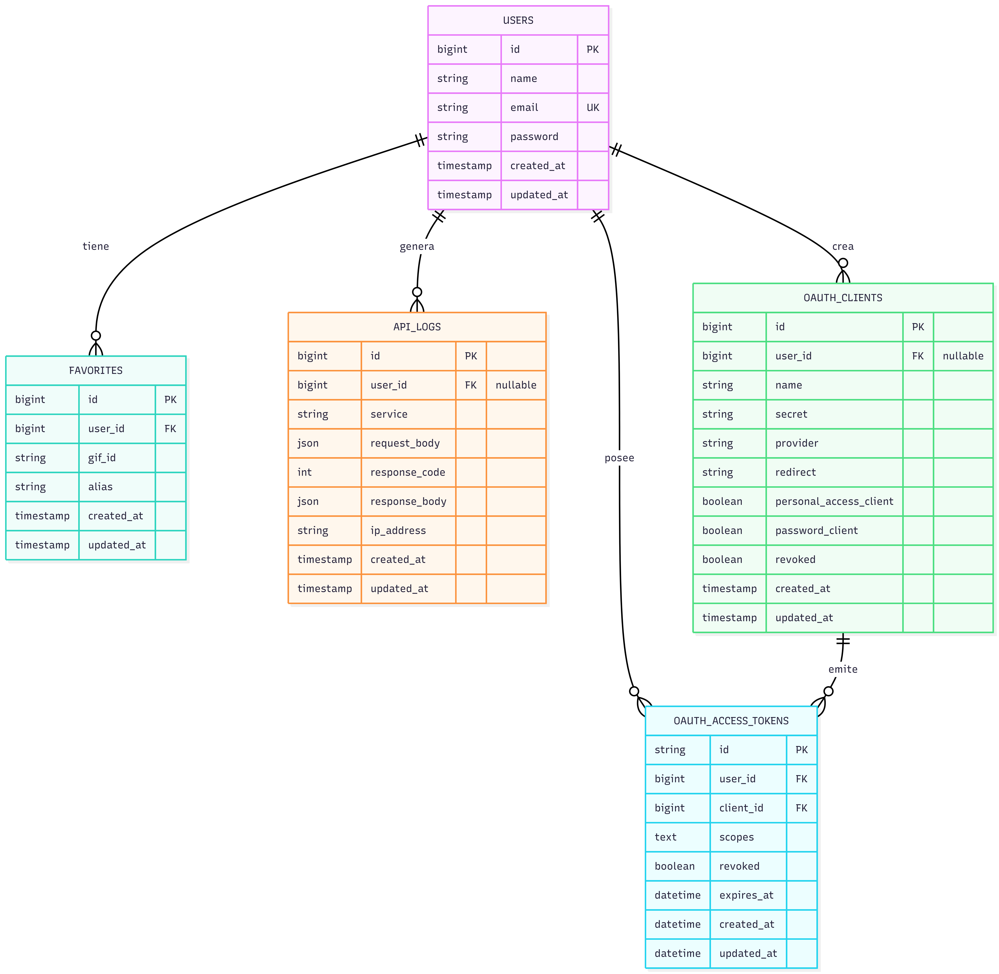

# Prex Challenge - GIPHY API

API RESTful desarrollada en PHP 8.5 y Laravel 12 para interactuar con la API de GIPHY. Incluye búsqueda de GIFs, gestión de favoritos por usuario y registro de auditoría asíncrono.

## Requisitos

- Git
- Docker y Docker Compose
- Entorno Linux (Nativo o WSL2)

## Instalación y Configuración

### 1. Instalar dependencias
```bash
docker run --rm \
    -u "$(id -u):$(id -g)" \
    -v "$(pwd):/var/www/html" \
    -w /var/www/html \
    laravelsail/php85-composer:latest \
    composer install --ignore-platform-reqs
```

### 2. Configurar alias de Sail (Opcional)
```bash
alias sail='[ -f sail ] && sh sail || sh vendor/bin/sail'
```

### 3. Variables de Entorno
```bash
cp .env.example .env
```
Para facilitar las pruebas se dejó la apikey de  GIPHY en el env.example. De querer usar la propia edite el archivo `.env` y añada su clave de la API de GIPHY:
```
GIPHY_API_KEY=ingrese_su_clave_aqui
```

### 4. Iniciar servicios
```bash
sail up -d
```

### 5. Inicializar la aplicación
```bash
sail artisan key:generate
sail artisan migrate:fresh --seed
sail artisan passport:keys --force
sail artisan passport:client --personal --name="Prex Client"
```
> El usuario de prueba sembrado es `test@test.com` con la contraseña `12345678`. Para un entorno de producción, las credenciales del usuario administrador se deben configurar en el archivo `.env` utilizando las variables `ADMIN_EMAIL` y `ADMIN_PASSWORD`.

## Ejecución de Pruebas

El proyecto utiliza una base de datos SQLite en memoria para las pruebas.

```bash
sail test
```

## Colección de Postman

Para facilitar la prueba de los endpoints, se incluye una colección de Postman en la raíz del proyecto. El archivo se denomina `Prex - Challenge.postman_collection.json` y contiene ejemplos de todas las peticiones disponibles en la API.

## Decisiones de Arquitectura

*   **Autenticación Stateless**: Se implementó Laravel Passport para la emisión de tokens JWT cumpliendo con el requerimiento  OAuth 2.0.
*   **Manejo de Excepciones**: La gestión de excepciones se centraliza en el método `withExceptions` de `bootstrap/app.php` (propio de Laravel 12), permitiendo una configuración moderna para devolver respuestas JSON estandarizadas.
*   **Data Transfer Objects (DTOs)**: Se utilizan DTOs para estandarizar y estructurar las respuestas de la API, asegurando un formato de salida consistente.
*   **Transacciones de Base de Datos**: Para asegurar la integridad de los datos (principio ACID), operaciones críticas como el guardado de favoritos se encapsulan dentro de transacciones de base de datos.
*   **Middleware Asíncrono para Auditoría**: El registro de actividad de la API (`ApiLog`) se ejecuta a través del método `terminate()` del middleware. Esto permite persistir los datos después de haber enviado la respuesta HTTP al cliente, minimizando la latencia.
*   **Abstracción de Servicios Externos**: La comunicación con la API de GIPHY se abstrae mediante interfaces y el contenedor de servicios de Laravel, aplicando el Principio de Inversión de Dependencias (SOLID) para desacoplar la implementación.

## Diagrama de Entidad-Relación (DER)

Se ha incluido un Diagrama de Entidad-Relación en la carpeta `docs` para visualizar la estructura de la base de datos. Puede consultar el archivo [DER.md](docs/DER.md) para una descripción detallada de las tablas y sus relaciones. El código del diagrama puede ser copiado y pegado en el editor online [Mermaid.live](https://mermaid.live/) para su visualización y modificación.



## Diagrama de Casos de Uso

Para una visión general de las funcionalidades y los actores del sistema, se ha incluido un diagrama de casos de uso en la carpeta `docs`. Puede consultar el archivo [casos de uso.md](docs/casos%20de%20uso.md) para ver el código fuente del diagrama, que también puede ser visualizado y modificado en [Mermaid.live](https://mermaid.live/).


## Diagrama de Secuencia

Para un análisis detallado del flujo de interacciones entre los componentes del sistema, se ha incluido un diagrama de secuencia en la carpeta `docs`. Puede consultar el archivo [diagrama secuencias.md](docs/diagrama%20secuencias.md) para ver el código fuente, que también es compatible con [Mermaid.live](https://mermaid.live/).


