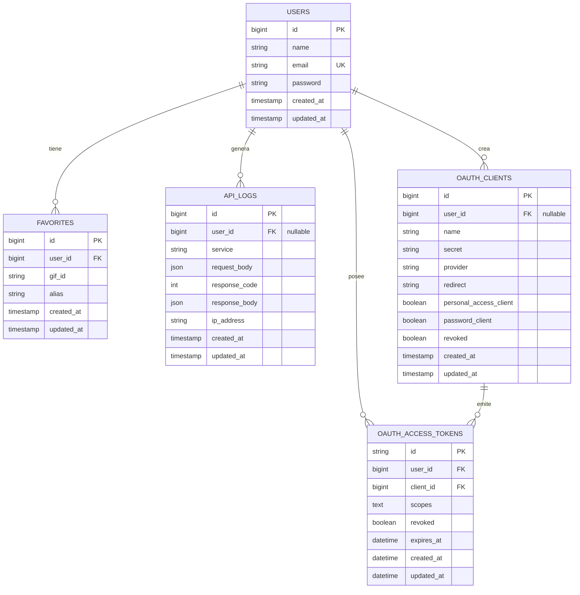

# Diagrama de Entidad-Relación (DER)

Este diagrama representa el modelo de datos relacional de la API, incluyendo las tablas de negocio, la auditoría y la gestión de tokens de OAuth2 (Passport).

El siguiente código puede ser copiado y pegado en el editor online [Mermaid.live](https://mermaid.live/) para su visualización y modificación.

