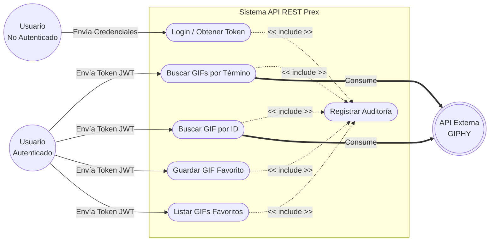

# Casos de Uso

Este diagrama ilustra los principales casos de uso de la API, los actores involucrados y las interacciones con sistemas externos.

El siguiente código puede ser copiado y pegado en el editor online [Mermaid.live](https://mermaid.live/) para su visualización y modificación.

