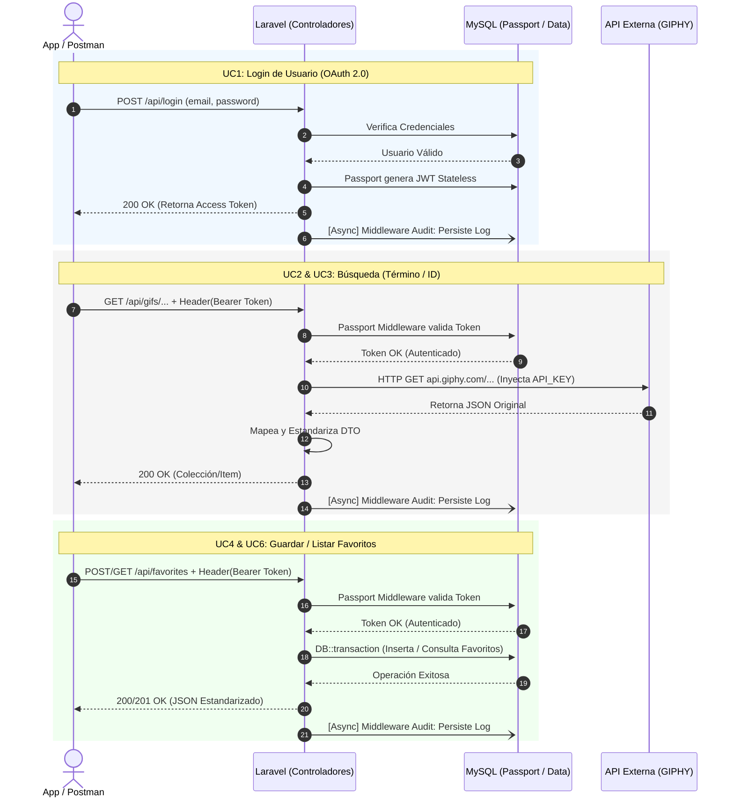

# Diagrama de Secuencia

Este diagrama detalla el flujo de interacciones entre los componentes del sistema para los casos de uso principales.

El siguiente código puede ser copiado y pegado en el editor online [Mermaid.live](https://mermaid.live/) para su visualización y modificación.

